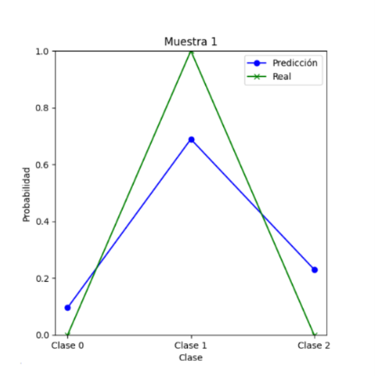
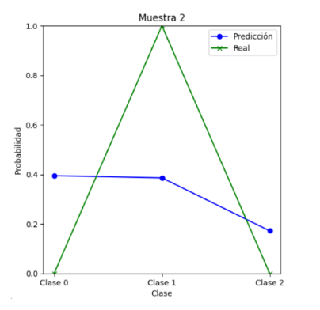
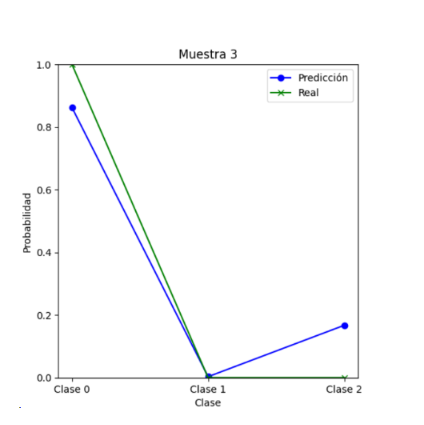
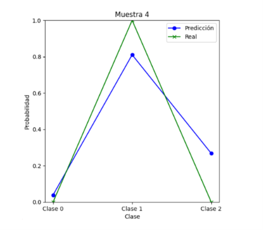

# Artificial Neural Network Model for Predicting Next Episode in Bipolar Disorder
# Artificial Neural Network for Predicting the Next Episode in Bipolar Disorder

## Overview

This project implements an Artificial Neural Network (ANN) in Python to predict the most likely subsequent episode in individuals diagnosed with bipolar disorder.

The model predicts one of three possible outcomes:

* **Depressive Episode** (Class 0)
* **Manic Episode** (Class 1)
* **Euthymic State** (Class 2)

Predictions are generated using clinical and treatment-related variables:

* Bipolar disorder type
* History of psychotic episodes
* Use of mood stabilizers
* Use of antidepressants
* Use of antipsychotics
* Use of lithium

The dataset was obtained from:

**Belief Updating in Euthymic Bipolar Disorder – Mendeley Data**
https://data.mendeley.com/datasets/crp8k3dgj5/2

---

## Data Preprocessing

Categorical variables were transformed into numerical representations before training the neural network.

```python
df['Bipolar_type'] = df['Bipolar_type'].replace(2, 0)

df['Psychosis_history'] = df['Psychosis_history'].replace({
    'yes': 0,
    'no': 1
})

df['Mood_Stabilizers'] = df['Mood_Stabilizers'].replace({
    'yes': 0,
    'no': 1
})

df['Lithium'] = df['Lithium'].replace({
    'yes': 0,
    'no': 1
})

df['Antidepressants'] = df['Antidepressants'].replace({
    'yes': 0,
    'no': 1
})

df['Antipsychotics'] = df['Antipsychotics'].replace({
    'yes': 0,
    'no': 1
})

df['Next_Episode_Polarity'] = df['Next_Episode_Polarity'].replace({
    'depressive': 0,
    'manic': 1,
    'euthymic': 2
})
```

---

## Model Architecture

The neural network was configured with:

| Parameter                | Value             |
| ------------------------ | ----------------- |
| Input Features           | 6                 |
| Hidden Layers            | 3                 |
| Neurons per Hidden Layer | 4                 |
| Output Classes           | 3                 |
| Activation Function      | Tanh              |
| Optimizer                | Adam              |
| Learning Rate            | 0.1               |
| Loss Function            | BCEWithLogitsLoss |
| Epochs                   | 100               |
| Random Seed              | 41                |
| Test Size                | 10%               |

---

## Model Performance

The model achieved an accuracy of:

**91.67%**

This result suggests that the ANN successfully learned meaningful relationships between patient characteristics and future episode polarity.

---

# Understanding the Prediction Plots

The plots compare the **true episode class** with the **probability distribution predicted by the neural network**.

### Ground Truth (Green Line)

The true labels were encoded using one-hot vectors:

| Episode    | Encoding  |
| ---------- | --------- |
| Depressive | [1, 0, 0] |
| Manic      | [0, 1, 0] |
| Euthymic   | [0, 0, 1] |

For example, if the actual next episode was manic, the ground-truth vector becomes:

```text
[0, 1, 0]
```

This explains why the green line only contains binary values (0 or 1).

### Predicted Probabilities (Blue Line)

The neural network does not directly output a class label.

Instead, it generates a probability estimate for each possible class.

For example:

```text
Depressive: 0.10
Manic:      0.69
Euthymic:   0.23
```

The predicted class corresponds to the category with the highest probability.

The purpose of these plots is not only to determine whether a prediction is correct, but also to visualize how confident the model is in its decision.

---

## Figure 1 – Correct Prediction (Manic Episode)




The actual class corresponds to a manic episode (Class 1).

The neural network assigns the highest probability to Class 1, indicating a correct prediction. Although some probability is distributed among the remaining classes, the model clearly identifies the manic episode as the most likely outcome.

**Interpretation:**
Correct classification with moderate confidence.

---

## Figure 2 – Ambiguous Prediction



The actual class corresponds to a manic episode (Class 1).

However, the model assigns similar probabilities to Classes 0 and 1, resulting in uncertainty regarding the final prediction.

**Interpretation:**
This example illustrates a difficult case where the model struggles to distinguish between competing episode categories.

---

## Figure 3 – Correct Prediction (Depressive Episode)



The actual class corresponds to a depressive episode (Class 0).

The network assigns a very high probability to Class 0 while assigning minimal probability to the remaining classes.

**Interpretation:**
Strong and confident prediction with clear separation between classes.

---

## Figure 4 – Correct Prediction (Manic Episode)



The actual class corresponds to a manic episode (Class 1).

The network assigns the highest probability to Class 1 and considerably lower probabilities to the remaining classes.

**Interpretation:**
Successful classification with high confidence.

---

## Discussion

The prediction plots demonstrate how the model distributes probability across all possible episode categories.

Unlike traditional classification outputs that only provide the final predicted class, these visualizations reveal the model's confidence and uncertainty.

Among the examples presented:

* Figures 1, 3, and 4 show successful classifications.
* Figure 2 illustrates a more challenging case where the network exhibits uncertainty.

These results suggest that the ANN learned clinically relevant patterns associated with future bipolar episodes. However, performance could potentially be improved through larger datasets, additional clinical predictors, and hyperparameter optimization.

---

## Technologies Used

* Python
* PyTorch
* NumPy
* Pandas
* Matplotlib
* Scikit-learn

---

## Author

**Sebastián Martín Ruiz Echegaray**
Psychology Student – Pontificia Universidad Católica del Perú (PUCP)


